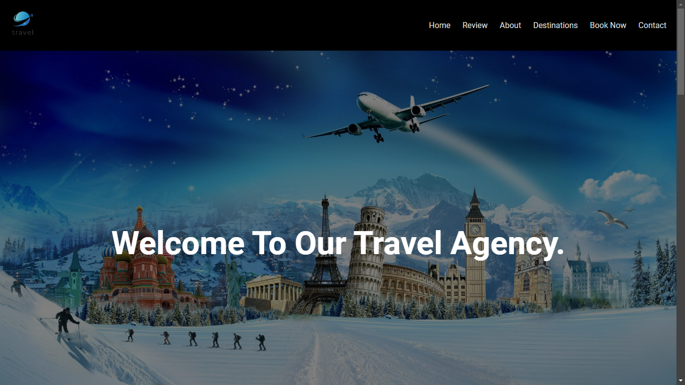

# ✈️ Travel Agency – Explore the World with Us

Welcome to my **Travel Agency** project – a vibrant and stylish website built for a fictional travel company. This project reflects my creativity and passion for front-end development, combining layout, UI elements, and a touch of humor to engage users.

> 🚀 Project Status: Intermediate Level | Responsive | Static Frontend | Under Improvement

---

## ✨ Features

- 🌍 Destination cards with pricing and images  
- 📑 Downloadable travel brochure button  
- 🧾 Booking form with validation-ready fields  
- 🗺️ Navigation bar for Home, About, and Services  
- 🧑‍💬 Testimonial section (fun + placeholder names)  
- 📞 Contact info section with location and email  

---

## 💻 Tech Stack

- HTML5  
- CSS3
- JavaScript

---

## 📸 Screenshots



---

## 🚧 Future Improvements

- Make the site fully responsive (mobile-friendly)  
- Replace placeholder testimonials with real customer reviews  
- Add interactive features (JS-based form validation, filters, etc.)  
- Integrate with a backend for actual bookings  

---

## 📦 Installation (for Local Preview)

```bash
1. Clone the repository:
   git clone https://github.com/Deeps1970/travel-agency.git

2. Navigate to the project folder:
   cd travel-agency

3. Open `index.html` in your browser.
```

## 📬 Contact
📧 thiagarajandeepu2007@gmail.com
📞 +91 63832 63688

## 🧠 Credits
Built with ❤️ by Deepak B T
